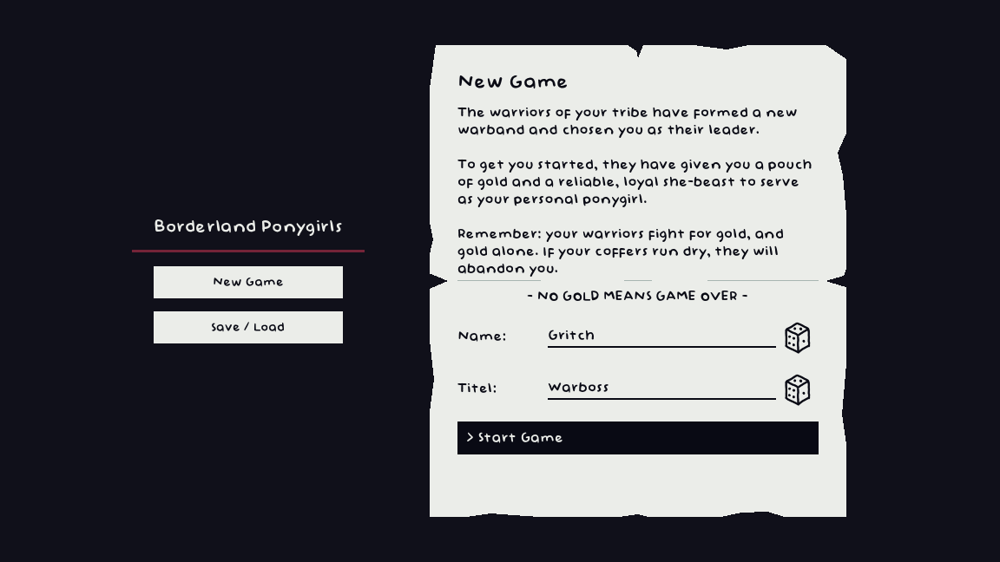
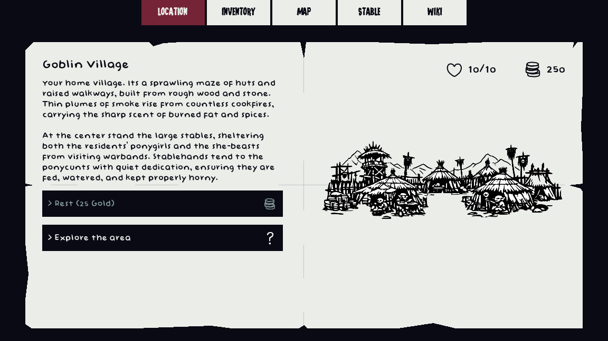
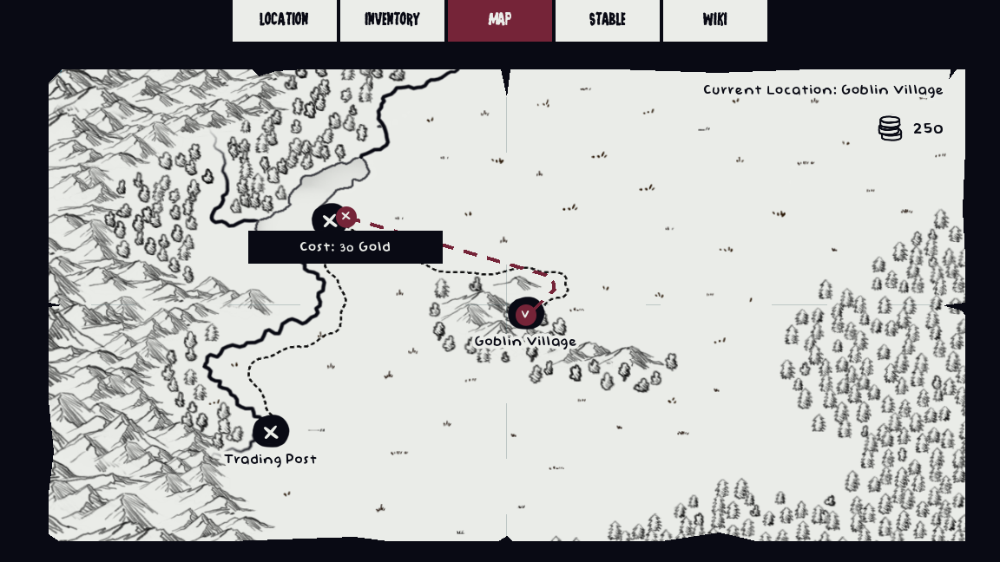
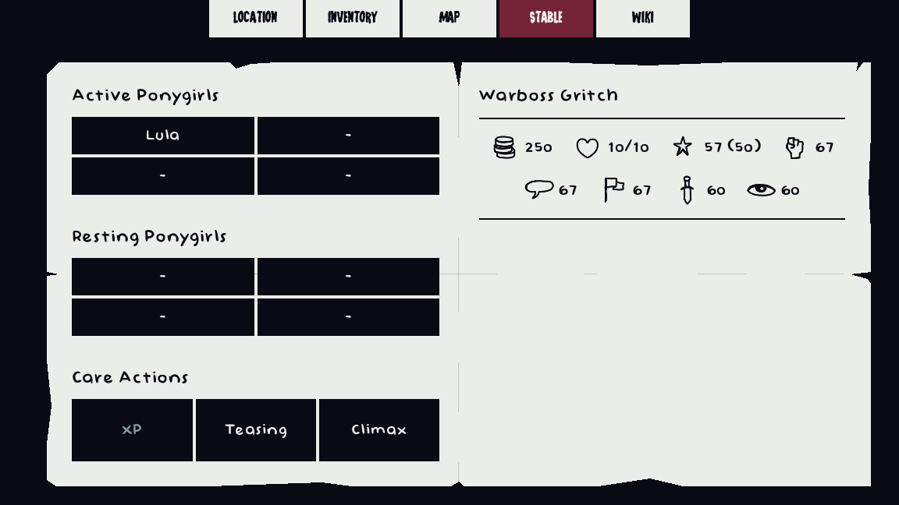

# Borderland Ponygirls

> [!WARNING]
> **Adults Only — 18+ / NSFW**
>
> This game contains explicit sexual content, nudity, fetish themes, ponyplay, slavery themes, and other mature subject matter. All depicted characters are adults.

## About the Game

**Borderland Ponygirls** is an erotic text-adventure game set in a lewd take on a classic fantasy world, where most intelligent species are either predominantly male or female.

You take on the role of a goblin warband boss. With no horses in this world, your people use human and elven maidens as ponygirls for transport and battle. Manage your mares, keeping them aroused, well-trained, and happy while earning money and turning your warband into a major power in the Borderlands.

In the past, goblins enslaved their ponygirls and forced them to serve. Nowadays, your peoples are allies, and your mares serve voluntarily. Yet the Borderlands remain wild and lawless.

Will you honor the peace — or return to the old ways?

Will you seek adventure, work as a merchant, or undertake diplomatic missions? It is entirely up to you.

## Development Status

**Borderland Ponygirls is currently in Pre-Alpha.**

Most of the core systems are implemented, and the game is technically playable. However, large parts of the world still lack quests, events, encounters, and other content.Expect unfinished areas, placeholder content, balancing issues, bugs, and breaking changes between versions.

## Features
* Lead and develop your own goblin warband.
* Acquire, manage, and train human and elven ponygirls.
* Manage each mare’s arousal, loyalty, training, and happiness.
* Travel through an open fantasy world.
* Earn money through trade, work, quests, and other activities.
* Encounter text-based events with different choices and outcomes.
* Fight enemies and overcome challenges through a textbased combat system.
* Decide whether to honor the alliance between your peoples or return to the old ways.
* Shape your warband through your own priorities and decisions.
* Expand the game with new events, quests, characters, and encounters.

## Screenshots






## Downloads

Official Pre-Alpha builds are available for:

* Windows
* Linux

Because the game is still in Pre-Alpha, existing save files may become incompatible with future versions.

## Running the Project from Source

The project is developed with **Godot 4.7**. To run it from source:

1. Install Godot 4.7.
2. Clone this repository:

   ```bash
   git clone https://github.com/LilCthulhu-dev/BorderlandPonygirls.git
   ```

3. Open Godot.
4. Import the repository’s `project.godot` file.
5. Open the project and run it from the editor.

The Godot project should work independently of your operating system. Official compiled builds are currently provided for Windows and Linux.

## Contributing

Borderland Ponygirls is intended to grow with help from its community. The main place for suggestions, feedback, discussion, and content submissions is the project’s Discord server.

[Link](https://discord.gg/dmRjc4J7g)

Contributions may include:

* Quests and storylines
* Random events and encounters
* Combat scenes
* Characters and dialogue
* Locations
* Bug reports
* Balance suggestions
* Code improvements

Please discuss larger additions on Discord before beginning substantial work. This helps ensure that the contribution fits the game’s setting, tone, structure, and current development plans.

GitHub Issues and Pull Requests may also be used for bug fixes, technical improvements, and community-created content.

More detailed contribution guidelines will be added as the project develops.

## Content Notice

This repository contains adult material and is not intended for minors.

The game explores consensual ponyplay alongside fictional themes of servitude, coercion, slavery, and abuse of power. The presence of these themes does not constitute endorsement of them.

All characters depicted in sexual situations are adults.
